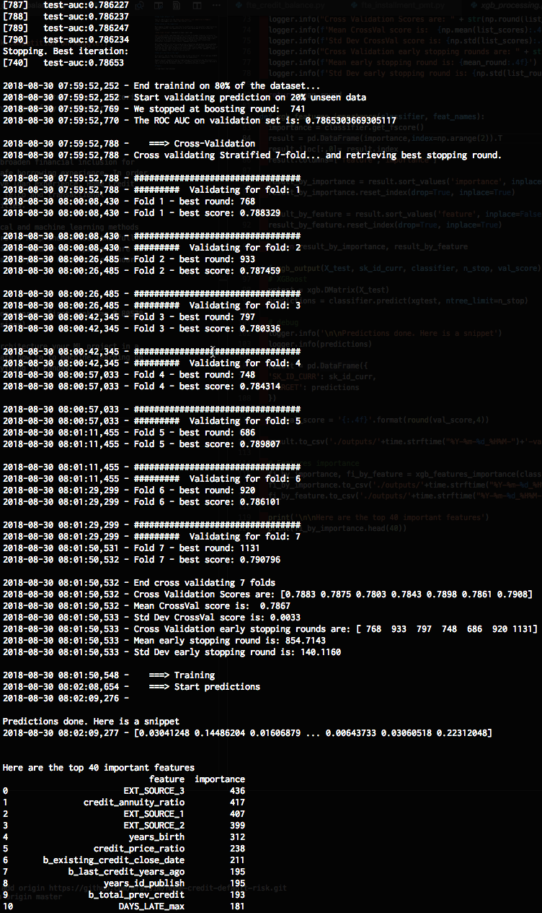
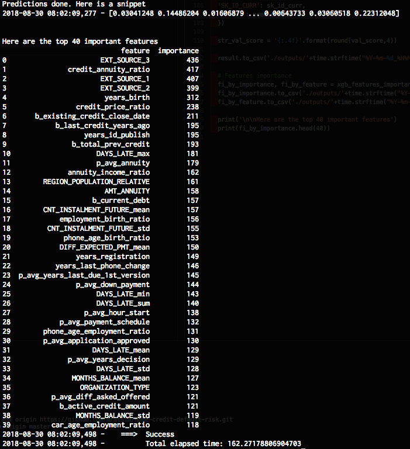
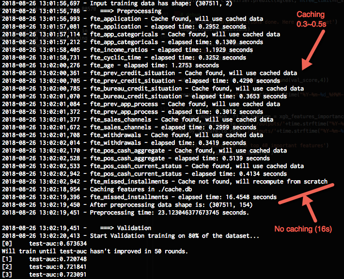
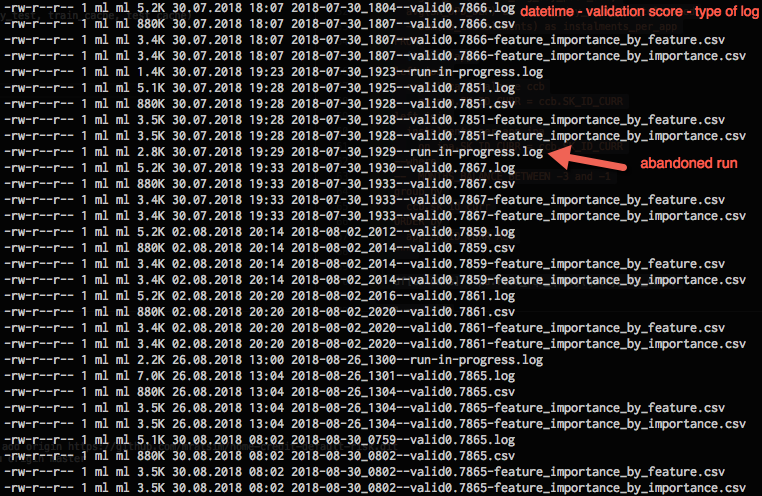
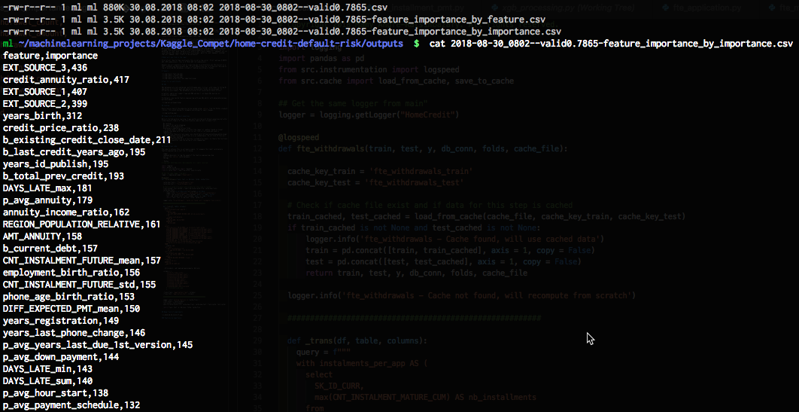
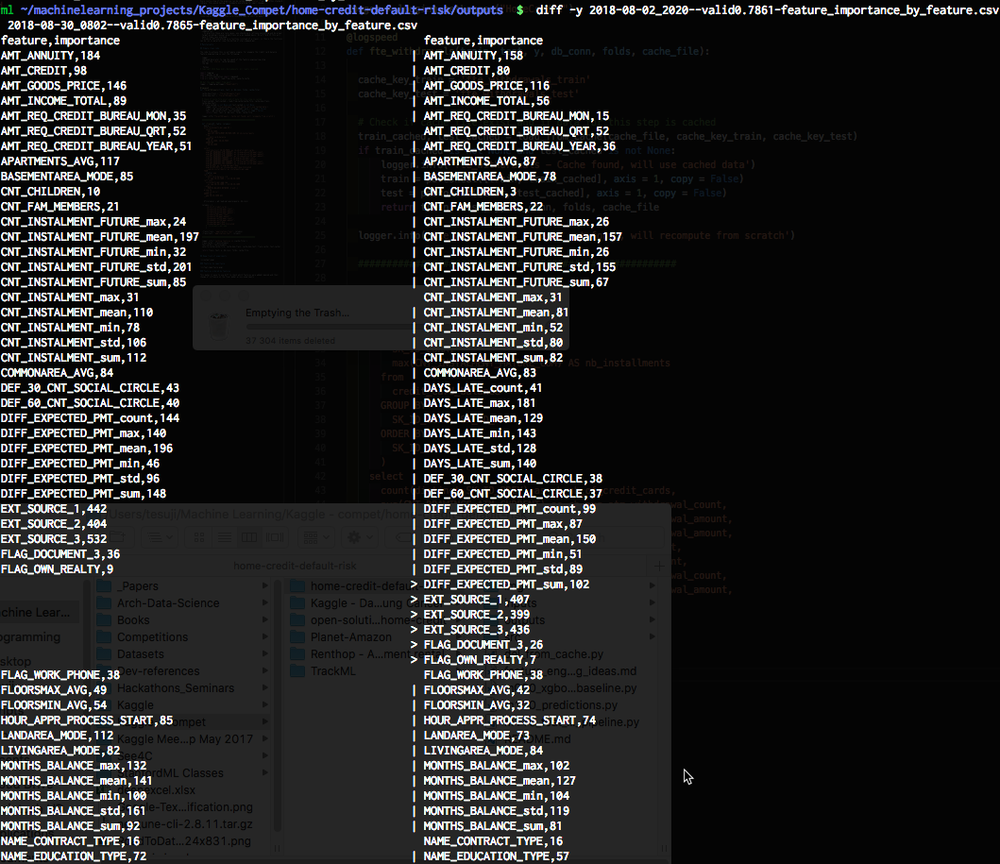

# Home Credit default risk

This is code I built for the [Home Credit default risk competition on Kaggle.](https://www.kaggle.com/c/home-credit-default-risk) This should be seen more as an ML engineering achievement than a data science top of the line prediction model.

# Description of the competition

Many people struggle to get loans due to insufficient or non-existent credit histories. And, unfortunately, this population is often taken advantage of by untrustworthy lenders.


[Home Credit](http://www.homecredit.net/) strives to broaden financial inclusion for the unbanked population by providing a positive and safe borrowing experience. In order to make sure this underserved population has a positive loan experience, Home Credit makes use of a variety of alternative data--including telco and transactional information--to predict their clients' repayment abilities.

While Home Credit is currently using various statistical and machine learning methods to make these predictions, they're challenging Kagglers to help them unlock the full potential of their data. Doing so will ensure that clients capable of repayment are not rejected and that loans are given with a principal, maturity, and repayment calendar that will empower their clients to be successful.

# What will you find in the repo?

First of all, due to time constraints this is not a top scorer. First rank was 0.80570 AUC (499 submissions), this is 0.78212 AUC (12 submissions).

However you will hopefully find an inspiring way to architecture your ML project in a fast, scalable and maintainable way. It also demonstrate how to to machine learning on top of existing SQL databases instead of loading everything in Pandas.

# Teasers






# Fast to run and iterate

## SQL

SQL databases are very optimized, multithreaded when critical, with index for O(log N) operations on critical path and operations on multiple fields can be grouped. In entreprise environment, SQL databases are also often installed on beefy servers.

⚠ Caution, spare your support team and DBA and don't run heavy SQL queries on production databases.

Furthermore, you can do feature engineering with any SQL editor with advanced previews, multiple panes:


## Caching

Every costly step of the pipeline can be cached using `shelve` from the Python standard library. This avoid having to recompute everything for small changes.



## Comparision with Sklearn pipelines

While I started machine learning, I was pretty excited with Sklearn pipelines but after tinkering with them a lot they unfortunately came up short on many front:

- No caching
- No support for early stopping
- No out-of-fold predictions
- Unnecessary computation across folds:
  - To avoid leaks on aggregate functions like "mean" or "median" based on target classes they make sure that only the current fold is retrieved and used in computation.
  - In practice those are rare cases, you should bulk retrieve everything and do proper target encoding/crossval predictions on a as needed basis. On a 5 fold CV this will have 5 times less overhead.
- Procedural API/everything is a function (instead of a class), in theory the functions can be run in parallel (see the bottom of star_command.py)

# Maintainable

## Simple clean code

The code to achieve this is extremely simple, for example the credit card balance feature engineering is just the following:

- logger
- `@logspeed` decorator to log the speed of the feature engineering step
- keys in the `shelve` cache database
- the SQL

```Python
# Copyright 2018 Mamy André-Ratsimbazafy. All rights reserved.

import logging
import pandas as pd
from src.instrumentation import logspeed
from src.cache import load_from_cache, save_to_cache

## Get the same logger from main"
logger = logging.getLogger("HomeCredit")

@logspeed
def fte_withdrawals(train, test, y, db_conn, folds, cache_file):

  cache_key_train = 'fte_withdrawals_train'
  cache_key_test = 'fte_withdrawals_test'

  # Check if cache file exist and if data for this step is cached
  train_cached, test_cached = load_from_cache(cache_file, cache_key_train, cache_key_test)
  if train_cached is not None and test_cached is not None:
      logger.info('fte_withdrawals - Cache found, will use cached data')
      train = pd.concat([train, train_cached], axis = 1, copy = False)
      test = pd.concat([test, test_cached], axis = 1, copy = False)
      return train, test, y, db_conn, folds, cache_file

  logger.info('fte_withdrawals - Cache not found, will recompute from scratch')

  ########################################################

  def _trans(df, table, columns):
    query = f"""
    with instalments_per_app AS (
      select
        SK_ID_CURR,
        max(CNT_INSTALMENT_MATURE_CUM) AS nb_installments
      from
        credit_card_balance
      GROUP BY
        SK_ID_CURR, SK_ID_PREV
      ORDER BY
        SK_ID_CURR
      )
    select
      count(distinct SK_ID_PREV) as cb_nb_of_credit_cards,
      avg(CNT_DRAWINGS_ATM_CURRENT) as cb_avg_atm_withdrawal_count,
      avg(AMT_DRAWINGS_ATM_CURRENT) as cb_avg_atm_withdrawal_amount,
      sum(AMT_DRAWINGS_ATM_CURRENT) as cb_sum_atm_withdrawal_amount,
      avg(CNT_DRAWINGS_CURRENT) as cb_avg_withdrawal_count,
      avg(AMT_DRAWINGS_CURRENT) as cb_avg_withdrawal_amount,
      avg(CNT_DRAWINGS_POS_CURRENT) as cb_avg_pos_withdrawal_count,
      avg(AMT_DRAWINGS_POS_CURRENT) as cb_avg_pos_withdrawal_amount,
      avg(SK_DPD) as cb_avg_day_past_due,
      avg(SK_DPD_DEF) as cb_avg_day_past_due_tolerated
      --sum(nb_installments) as instalments_per_app
    FROM
      {table} app
    left join
      credit_card_balance ccb
        on app.SK_ID_CURR = ccb.SK_ID_CURR
    left join
      instalments_per_app ipa
        on ipa.SK_ID_CURR = ccb.SK_ID_CURR
    --where
    --  MONTHS_BALANCE BETWEEN -3 and -1
    group by
      ccb.sk_id_curr
    ORDER by
      app.SK_ID_CURR ASC
    """

    df[columns] = pd.read_sql_query(query, db_conn)

  columns = [
      'cb_nb_of_credit_cards',
      'cb_avg_atm_withdrawal_count',
      'cb_avg_atm_withdrawal_amount',
      'cb_sum_atm_withdrawal_amount',
      'cb_avg_withdrawal_count',
      'cb_avg_withdrawal_amount',
      'cb_avg_pos_withdrawal_count',
      'cb_avg_pos_withdrawal_amount',
      'cb_avg_day_past_due',
      'cb_avg_day_past_due_tolerated'
      # 'instalments_per_app'
      ]

  _trans(train, "application_train", columns)
  _trans(test, "application_test", columns)

  ########################################################

  logger.info(f'Caching features in {cache_file}')
  train_cache = train[columns]
  test_cache = test[columns]
  save_to_cache(cache_file, cache_key_train, cache_key_test, train_cache, test_cache)

  return train, test, y, db_conn, folds, cache_file
```

## Keep track of experiments



### Features by importance



### Features ordered by features

This makes it easy to use diff to check which features were added/removed and their change of influence on the final model across experiments



# Scalable

All the instrumentation provided makes it much easier to keep track on what is going on and not have the dreaded "oh what did I change, I had a much better results previously".

It also makes it much easier to collaborate on the same model.

Pipeline transformations are all done in a [single file](m110_feat_engineering_pipeline.py) and can be easily commented in or out:

```Python
from src.star_command import feat_engineering_pipe
from src.feature_engineering.fte_money import fte_income_ratios, fte_goods_price
from src.feature_engineering.fte_cyclic_time import fte_cyclic_time
from src.feature_engineering.fte_age import fte_age
from src.feature_engineering.fte_money_bureau import fte_bureau_credit_situation
from src.feature_engineering.fte_prev_app import fte_prev_credit_situation, fte_prev_app_process, fte_sales_channels
from src.feature_engineering.fte_credit_balance import fte_withdrawals
from src.feature_engineering.fte_pos_cash import fte_pos_cash_aggregate, fte_pos_cash_current_status
from src.feature_engineering.fte_installment_pmt import fte_missed_installments

from src.feature_extraction.fte_application import fte_application, fte_app_categoricals

pipe_transforms = feat_engineering_pipe(
  fte_application,
  fte_app_categoricals,
  fte_income_ratios,
  fte_cyclic_time,
  fte_goods_price,
  fte_age,
  fte_prev_credit_situation,
  fte_bureau_credit_situation,
  fte_prev_app_process,
  fte_sales_channels,
  fte_withdrawals,
  fte_pos_cash_aggregate,
  fte_pos_cash_current_status,
  fte_missed_installments
)
```

And being SQL based means that this can be done on big data and clusters.

# Conclusion

I hope you learned something with this repo. Feel free to ask questions in Github issues.
